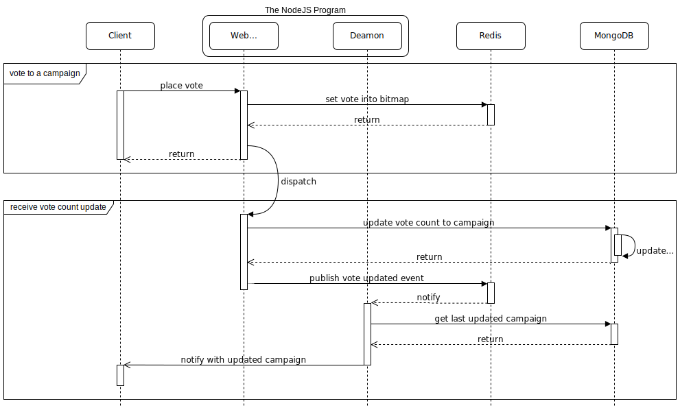

# SImple Voting

## Pre-requirements
1. NodeJS v12+
2. Docker v19+

## Setup
1. Create a `.env` file at root and copy the content from `.env.example`:
   ```sh
    cp .env.example .env
   ```
2. By default, port 27017 and 6379 will be used for our MongoDB and Redis instance, respectively. If these ports are already in use, please change the port number in your `.env` file and it should be align with `docker-compose.yml` file.
3. Launch MongoDB and Redis via docker compose:
   ```sh
   docker-compose up
   ```
4. Install project dependencies:
   ```sh
    npm i
   ```
5. Launch server:
   ```sh
   npm start
   ```
   By default, port 8080 will be used by the NodeJS server. If this port is already in use, please pass a new port number through the `PORT` envirnment variable when launching, for example:
   ```sh
    PORT=8888 npm start
   ```

## Unit Tests
There are few test cases that cover the core services. You may run through this command:
```sh
npm run test
```

## API Doc
This server was generated by the [swagger-codegen](https://github.com/swagger-api/swagger-codegen) project. Please checkout the server API from the following page (You have to launch the server first):
```
http://localhost:8080/docs
```

## Postman Collection
There is a `postman-collection.json` file (v2.1) at the project root which contains examples of how to interact with the HTTP API. You may import it into your postman application. Notice that you should change the IDs recorded in the collection to the actual values found in your runtime, or else almost of the requests will be failure.

## The Campaign charts
You may found all the campaign charts by visiting `http://localhost:8080/pages/charts`, which also establish a websocket connection to the deamon of the program for receiving last campaign vote counts.

## How the Voting works
The NodeJS program will launch a web server and a deamon. The web server provides HTTP interface to access campaigns and users data stored in MongoDB. User votes will be stored as bitmaps in Redis for fast write (AOF enabled).

Each time after writing user vote into the bitmap in Redis, it will asynchronously updates the vote counts of the campaign in MongoDB, which also update the index for fast read.

While the asynchronous action completed, a `voteUpdate` event will be emitted through Redis. The daemon will receives this event and then notify all its clients with the updated campaign data through websocket.

Here is how a voting request being processed internally:



To ensure that the vote counts in MongoDB are eventually consistent with the bitmaps in Redis, even encounter program crashs, the daemon also periodically updates the vote counts from Redis to MongoDB.

Since the program is designed to be horizontally scalable, there is a `daemon lock` implemented in Redis so that only one daemon can performs the above updates.

## High Traffic and Scalable Architecture Design
While the NodeJS program is ease for scale, it would be better to have Cluster + Replica structure for both the Redis and MongoDB:


